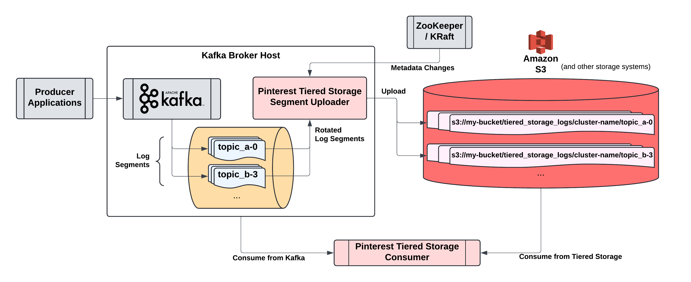

# Kafka Tiered Storage
This edition of Kafka tiered storage provides a Kafka broker independent approach to tiered storage. It consists of two main components:
1. [Uploader](ts-segment-uploader): A continuous process that runs on each Kafka broker and uploads finalized log segments to a remote storage system (e.g. Amazon S3, with unique prefix per Kafka cluster and topic).
2. [Consumer](ts-consumer): A Kafka client compatible consumer that consumes from both tiered storage log segments and Kafka cluster.

A third module [ts-common](ts-common) contains common classes and interfaces that are used by the `ts-consumer` and `ts-segment-uploader` modules, such as Metrics, StorageEndpointProvider, etc.

Feel free to read into each module's README for more details.

## Highlights
- **Kafka Broker Independent**: The tiered storage solution is designed to be Kafka broker independent, meaning it runs as an independent process alongside the Kafka server process. Currently, it only supports ZooKeeper-based Kafka versions. KRaft support is WIP.
- **Fault Tolerant**: Broker restarts, replacements, leadership changes, and other common Kafka operations / issues are handled gracefully.
- **Skip the broker entirely during consumption**: The consumer can read from both broker and Tiered Storage backend filesystem. When in TIERED_STORAGE_ONLY mode, the consumption loop does not touch the broker itself, allowing for reduction in broker resource utilization.
- **Pluggable Storage Backends**: The framework is designed to be backend-agnostic. Currently, only S3 is supported. More backend filesystems will be supported in the near future.
- **S3 Partitioning**: Prefix-entropy (salting) is configurable out-of-the-box to allow for prefix-partitioned S3 buckets, allowing for better scalability by avoiding request rate hotspots.
- **Metrics**: Comprehensive metrics are provided out-of-the-box for monitoring and alerting purposes.

# Quick Start
Detailed quickstart instructions are available [here](docs/quickstart.md).

# Architecture

# Current Status
This project is currently under active development. Some of our planned features and improvements:

- KRaft support
- More backend filesystems (e.g. HDFS)
- Integration with [PubSub Client](https://github.com/pinterest/psc) (backend-agnostic client library)

Contributions are always welcome!

# Maintainers
- Vahid Hashemian
- Jeff Xiang

# License
Kafka Tiered Storage is distributed under Apache License, Version 2.0.
