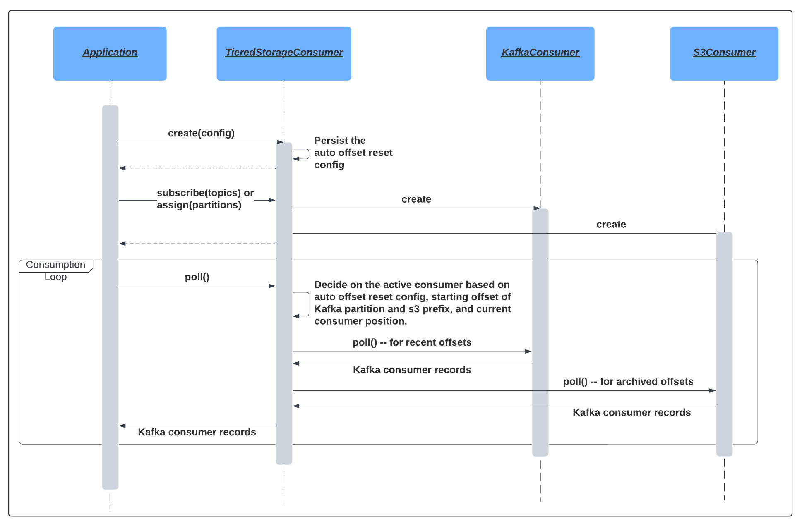

# Kafka Consumer with Tiered Storage Consumption Support

## Overview
This module contains `TieredStorageConsumer` which supports reading Kafka records from both Kafka brokers and tiered storage (e.g. S3). 
It is based on the `KafkaConsumer` class and uses its APIs to read records from Kafka brokers, just as the regular Kafka consumer does.
It uses the `S3Consumer` APIs to read records from tiered storage. Currently only S3 is supported as the filesystem backing tiered storage.

## Architecture


## Consumption Modes
The consumer can be configured to read records from Kafka brokers, S3, or both. The following consumption modes are supported:
1. `KAFKA_PREFERRED`: Read records from Kafka brokers. If an offset is out of range in Kafka, read it from S3. This mode is what most use cases would likely specify.
2. `KAFKA_ONLY`: Read records from Kafka brokers only. This mode is the same as reading using a `KafkaConsumer`.
3. `TIERED_STOARGE_PREFERRED`: If an offset is present in both Kafka broker and S3, read from S3. If an offset is present in Kafka only, read from Kafka (this mode is not supported at the moment)
4. `TIERED_STORAGE_ONLY`: Read records from S3 only (experimental feature)

## Configuration
The consumer can be configured the same way as a regular Kafka consumer. In addition, the following properties can be set:
1. `tiered.storage.mode`: The consumption mode. It can be one of the following values: `KAFKA_PREFERRED`, `KAFKA_ONLY`, `TIERED_STORAGE_PREFERRED`, `TIERED_STORAGE_ONLY`.
2. `kafka.cluster.id`: This is supplied by the user to identify the Kafka cluster that the consumer is reading from. This is used to determine the S3 prefix to read from, 
and should match the cluster ID supplied by the segment uploader.
3. `offset.reset.policy`: This can be `EARLIEST`, `LATEST`, or `NONE`. Only setting this to `EARLIEST` will result in the consumer
falling back to reading from S3 if an offset is out of range in Kafka. Setting it to `NONE` will result in the consumer throwing an exception if an offset is out of range in Kafka.
Setting it to `LATEST` will result in the consumer resetting offsets to latest in Kafka if an offset is out of range in Kafka.
4. `storage.service.endpoint.provider.class`: The fully qualified class name of the class that provides the backing filesystem's endpoints for tiered storage consumption.
5. `storage.service.endpoint.s3.prefix.entropy.num.bits`: The number of bits of entropy to use for prefixing S3 keys. Make sure to set this to the same value as the segment uploader's equivalent config
in order to allow the consumer to read from the correct S3 location. More details on prefix entropy can be found in the [ts-segment-uploader README](../ts-segment-uploader/README.md).

## Usage
The consumer can be used the same way as a regular Kafka consumer. There are API gaps that are actively being addressed.
The consumer currently only returns byte arrays without SerDe support.

```
Properties props = new Properties();
props.put("bootstrap.servers", "localhost:9092");
props.put("group.id", "test");
props.put("tiered.storage.mode", "KAFKA_PREFERRED");
props.put("kafka.cluster.id", "test-cluster");
props.put("offset.reset.policy", "EARLIEST");
props.put("storage.service.endpoint.provider.class", MockS3StorageServiceEndpointProvider.class.getName());

TieredStorageConsumer<String, String> consumer = new TieredStorageConsumer<>(props);
consumer.subscribe(Collections.singletonList("test-topic"));

while (true) {
   consumer.poll(Duration.ofMillis(100)).forEach(record -> {
      System.out.println(record.value());
   });
}
```

## Build
To build with maven:
```
mvn clean install
```

## Test
To run tests with maven:
```
mvn test
```
