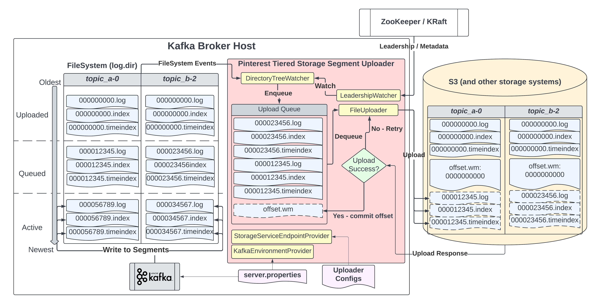

# Tiered Storage Segment Uploader

## Overview
This module contains the uploader code that is used to upload Kafka log segments to the backing tiered storage filesystem.
It is designed to be a long-running and independent process that runs on each Kafka broker in order to upload
finalized (closed) log segments to a remote storage system. These log segments can later be read by a 
[TieredStorageConsumer](../ts-consumer) even if the log segments have already been deleted from local storage on the broker, provided
that the retention period of the segments on remote storage system is longer than that of the Kafka topic itself.

## Architecture


The uploader process runs alongside the Kafka server process on every broker, and is responsible for uploading log segments 
to the configured remote storage system.

The key components to the uploader are:
1. [KafkaSegmentUploader](src/main/java/com/pinterest/kafka/tieredstorage/uploader/KafkaSegmentUploader.java): The entrypoint class
2. [DirectoryTreeWatcher](src/main/java/com/pinterest/kafka/tieredstorage/uploader/DirectoryTreeWatcher.java): Watches the Kafka log directory for log rotations (closing and opening of new log segments)
3. [KafkaLeadershipWatcher](src/main/java/com/pinterest/kafka/tieredstorage/uploader/KafkaLeadershipWatcher.java): Monitors leadership changes in the Kafka cluster and updates the watched filepaths as necessary
4. [FileUploader](src/main/java/com/pinterest/kafka/tieredstorage/uploader/S3FileUploader.java): Uploads the log segments to the remote storage system
5. [KafkaEnvironmentProvider](src/main/java/com/pinterest/kafka/tieredstorage/uploader/KafkaEnvironmentProvider.java): Provides information about the Kafka environment for the uploader

If a broker is currently a leader for a topic-partition, the uploader will watch the log directory for that topic-partition.
When a previously-active log segment is closed, the uploader will upload the closed segment to the remote storage system. Typically, 
a log segment is closed when it reaches a time or size-based threshold, configurable via Kafka broker properties.

Each upload will consist of 3 parts: the segment file, the index file, and the time index file. Once these files are successfully
uploaded, an `offset.wm` file will also be uploaded for that topic partition which contains the offset of the last uploaded log segment.
This is used to resume uploads from the last uploaded offset in case of a failure or restart.

## Usage
The segment uploader entrypoint class is `KafkaSegmentUploader`. At a minimum, running the segment uploader requires:
1. **KafkaEnvironmentProvider**: This system property should be provided upon running the segment uploader (i.e. `-DkafkaEnvironmentProvider`). It should
provide the FQDN of the class that provides the Kafka environment, which should be an implementation of [KafkaEnvironmentProvider](src/main/java/com/pinterest/kafka/tieredstorage/uploader/KafkaEnvironmentProvider.java).
2. **Uploader Configurations**: The directory in which uploader configurations live should be provided as the first argument to the segment uploader main class. 
It should point to a directory which contains a `.properties` file that contains the configurations for the segment uploader. The file that
the uploader chooses to use in this directory is determined by the Kafka cluster ID that is provided by `clusterId()` method
for the `KafkaEnvironmentProvider` implementation. Therefore, the properties file should be named as `<clusterId>.properties`.
3. **Storage Endpoint Configurations**: The segment uploader requires a [StorageServiceEndpointProvider](../ts-common/src/main/java/com/pinterest/kafka/tieredstorage/common/discovery/StorageServiceEndpointProvider.java)
to be specified in the properties file. This provider's implementation dictates where each topic's log segments should be uploaded to.

For a more detailed guide on how to run the segment uploader, refer to the [Quickstart Guide](../docs/quickstart.md).

## S3 Prefix Entropy
The segment uploader supports prefix entropy (salting) for S3 uploads. This is useful for avoiding request rate hotspots on S3. To enable
prefix entropy, set the `ts.segment.uploader.s3.prefix.entropy.bits` configuration in the properties file. This configuration specifies
the number of bits of entropy to use to inject in the prefix of keys uploaded to S3.

The bits are generated via an MD5 (128-bit) hash of the cluster ID, topic name, and partition ID of the log segment being uploaded. The hash is then 
truncated to the leftmost X number of bits specified in the configuration.

Here is a simple example: Let's assume that with 0 bits of entropy (i.e. no entropy at all), a log segment object uploaded to S3
would be identified by the URI: 
```
s3://my-bucket/my-prefix/my-cluster/my-topic-0/00000000000000000000.log
```

With 3 bits of entropy, the leftmost 3 bits of the MD5 hash generated by the cluster, topic, and partition combination
would be `111`. Therefore, the object would be uploaded to:
```
s3://my-bucket/my-prefix/111/my-cluster/my-topic-0/00000000000000000000.log
```

With prefix entropy, one can pre-partition the S3 bucket using the prefix bits to avoid request rate hotspots on S3.

Because the hash is generated via the cluster, topic, and partition ID combination, all log segments (and their associated `.index`, `.timeindex`, and `offset.wm` files)
for a given topic-partition on a given cluster will be uploaded to the same prefix in S3. This way, the [TieredStorageConsumer](../ts-consumer/src/main/java/com/pinterest/kafka/tieredstorage/consumer/TieredStorageConsumer.java)
can deterministically reconstruct the entire key during consumption. Due to this reason, **it is important to ensure that the `ts.segment.uploader.s3.prefix.entropy.bits` 
configuration is consistent across all brokers in the Kafka cluster, and consistent in the consumer's configuration as well**.

## Configuration
The segment uploader configurations are passed via the aforementioned properties file. Available configurations
are listed in [SegmentUploaderConfiguration](src/main/java/com/pinterest/kafka/tieredstorage/uploader/SegmentUploaderConfiguration.java) class.

## Build
To build with maven:
```
mvn clean install
```

## Test
To run tests with maven:
```
mvn test
```